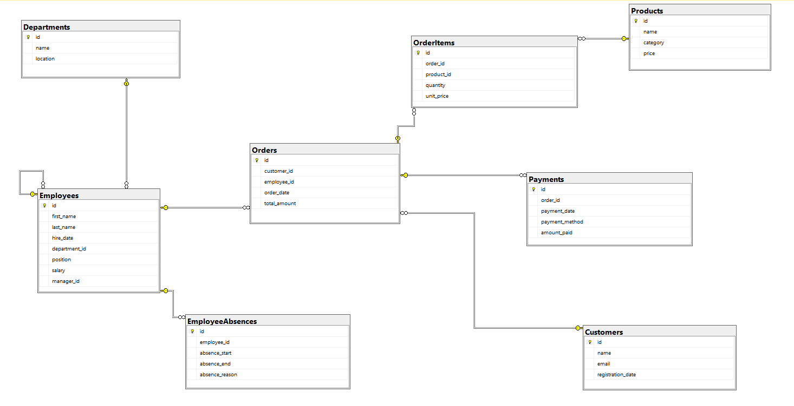

## SQL Practice Project – Core SQL Concepts & Query Patterns

This project is focused on developing and testing SQL skills using a rich set of real-world query patterns. It uses a multi-table business-style database and covers a wide range of SQL functionalities essential for data analysis, reporting, and application development.

### 🎯 Key SQL Topics Practiced

This repository includes hands-on practice with the following SQL topics:

* **CASE statements** – conditional logic in queries
* **String functions** – manipulating and analyzing text using `LEN`, `REPLACE`, `SUBSTRING`, `CHARINDEX`, `LOWER`, `UPPER`, and more
* **Date functions** – working with dates via `DATEDIFF`, `FORMAT`, `GETDATE`, etc.
* **Window functions** – using `ROW_NUMBER()`, `RANK()`, `DENSE_RANK()`, and `OVER(PARTITION BY ...)`
* **UNION / UNION ALL** – combining result sets
* **Subqueries** – scalar, correlated, and table subqueries
* **CTEs (Common Table Expressions)** – including recursive CTEs
* **Triggers** – automatic execution on data changes
* **Stored Procedures vs Functions** – procedural logic, input parameters, return values
* **Temporary Tables** – using `#temp` and `@table` variables for intermediate steps
* **ALTER, MODIFY, DELETE** – schema and data manipulation
* **TRY...CATCH blocks** – error handling in T-SQL
* **PIVOT / UNPIVOT** – transforming row values into columns
* **MERGE statements** – upsert logic (insert/update/delete in one step)
* **DECLARE, EXEC, SET** – variable declarations, dynamic SQL, and procedural flow
* **User-defined variables** – logic encapsulation and reusability
* **CROSS APPLY / OUTER APPLY** – advanced row-by-row subqueries and table-valued functions

### 📌 Goals

* Build confidence in writing efficient, readable, and correct SQL
* Explore real-life scenarios with queries that simulate business questions
* Prepare for technical interviews and data analytics tasks
